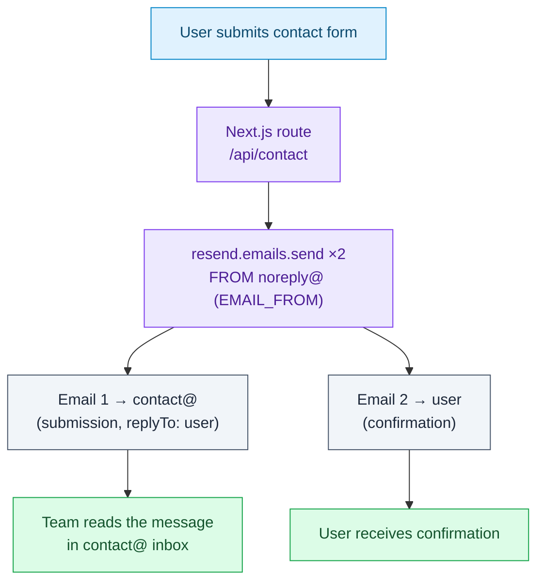
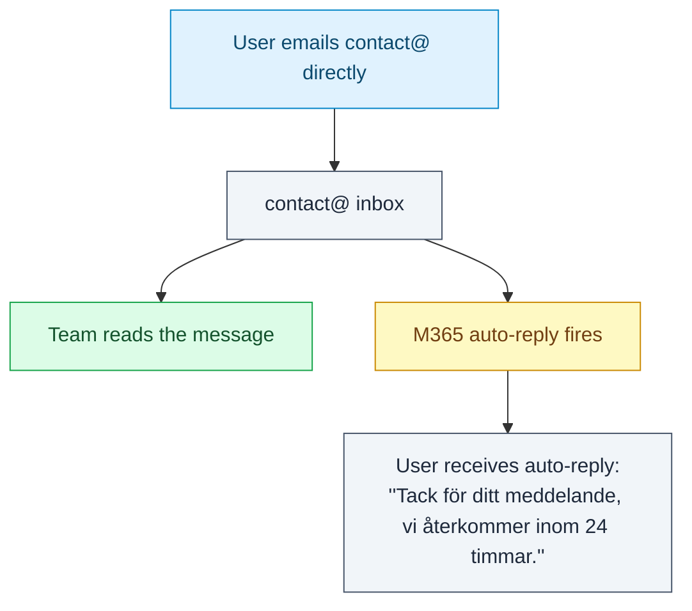
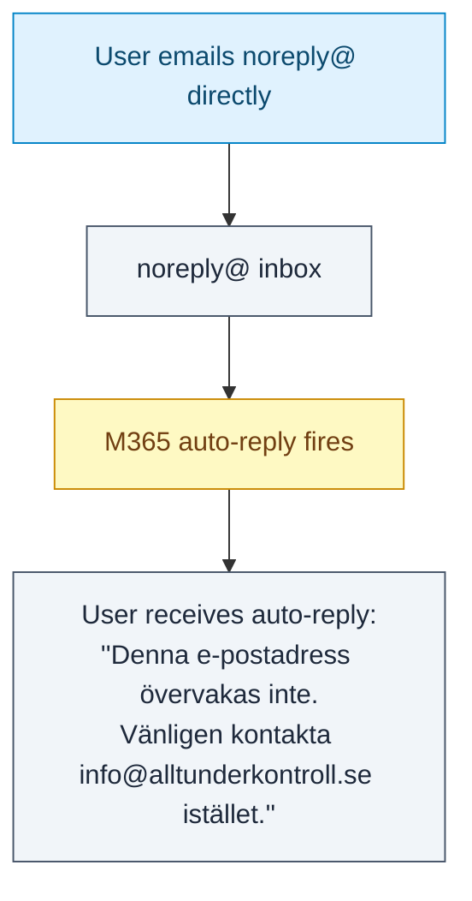

# Contact Email Flows

How email moves through the system for the contact form and the two shared
mailboxes (`noreply@alltunderkontroll.se`, `contact@alltunderkontroll.se`).

- **Form sends** are handled in code via **Resend** -
  `frontend/src/app/api/contact/route.ts`.
- **Direct emails** to the mailboxes are handled by M365 auto-reply rules
  (configured Exchange-side, not in code).

### Legend

| Style    | Meaning                          |
| -------- | -------------------------------- |
| Blue     | User action                      |
| Purple   | Our backend (Next.js + Resend)   |
| Slate    | An email message                 |
| Green    | Desired end state                |
| Amber    | M365 auto-reply (Exchange rule)  |

---

## Flow 1: Website contact form (via Resend)

The backend sends **two** emails via Resend, both **FROM `noreply@`** (`EMAIL_FROM`):
the submission to the team and a confirmation to the user.

> The team can reply to a submission directly from `contact@` - the message sets
> `replyTo` to the user's address, so replies go to the user, not to `noreply@`.

---

## Flow 2: User emails `contact@` directly

> Excludes sender `noreply@alltunderkontroll.se`, so it only replies to direct
> emails - never to the form's own submission (Flow 1).

---

## Flow 3: User emails `noreply@` directly

